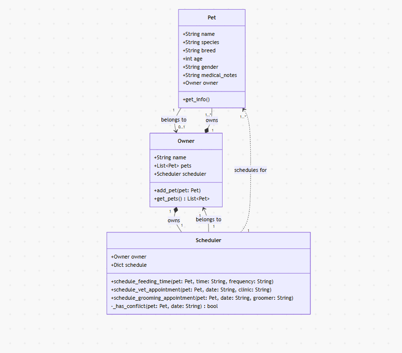
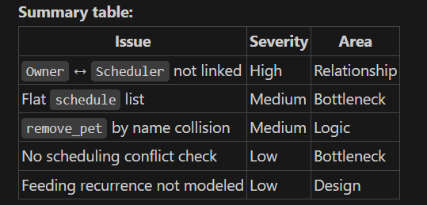

# PawPal+ Project Reflection

## 1. System Design

# Three core requirements:
1. add a pet
2. create e feeding schedule
3. schedule a veterinarian visit
[4. grooming appointment]

**a. Initial design**

- Briefly describe your initial UML design.
    - The app should have classes such as Owner, Pet, and Scheduler. Owner owns the pet and uses the scheduler to schedule the tasks. 
- What classes did you include, and what responsibilities did you assign to each?
    - Owner should have the name of the person who the pet(s) belong to and it should have the name of the person and the name of the pets 
    - Pet class should hold values like the name of the pet, species of pet, breed, age, etc
    - Scheduler class should have 3 methods for feeding schedule, vet appointment, and possibly grooming appointment 

**b. Design changes**

- Did your design change during implementation?
    - These are the changes it suggested 
    
        - I implemented all the changes because it made sense, except remove_pet() and instead I deleted remove_pet() method for now. Removing a pet could be an option for the future because someone could give away their pet or it could pass away, but I won't be considering that for now. 
- If yes, describe at least one change and why you made it.

---

## 2. Scheduling Logic and Tradeoffs

**a. Constraints and priorities**

- What constraints does your scheduler consider (for example: time, priority, preferences)?
- How did you decide which constraints mattered most?

**b. Tradeoffs**

- Describe one tradeoff your scheduler makes.
- Why is that tradeoff reasonable for this scenario?

---

## 3. AI Collaboration

**a. How you used AI**

- How did you use AI tools during this project (for example: design brainstorming, debugging, refactoring)?
- What kinds of prompts or questions were most helpful?

**b. Judgment and verification**

- Describe one moment where you did not accept an AI suggestion as-is.
- How did you evaluate or verify what the AI suggested?

---

## 4. Testing and Verification

**a. What you tested**

- What behaviors did you test?
- Why were these tests important?

**b. Confidence**

- How confident are you that your scheduler works correctly?
- What edge cases would you test next if you had more time?

---

## 5. Reflection

**a. What went well**

- What part of this project are you most satisfied with?

**b. What you would improve**

- If you had another iteration, what would you improve or redesign?

**c. Key takeaway**

- What is one important thing you learned about designing systems or working with AI on this project?
